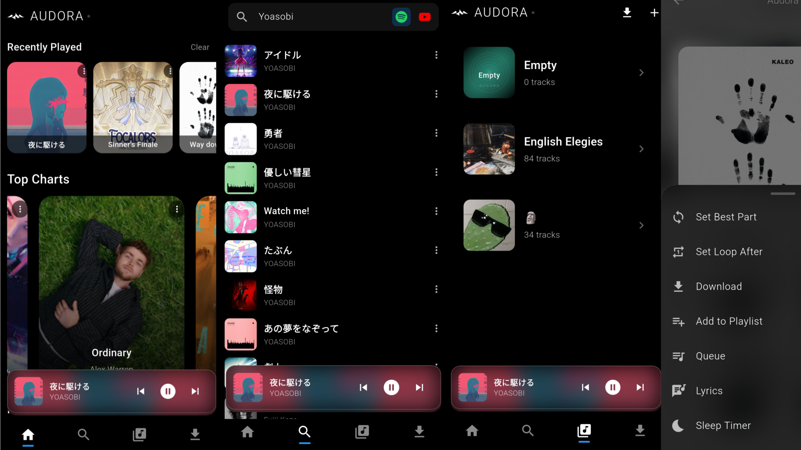
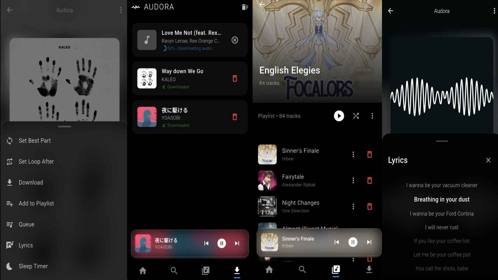

# Audora 🌀

Audora is a personal modern Flutter based music streaming app that lets you search, stream, and manage your own music tracks and playlists powered by Youtube and integrated with Spotify playlist import.

It’s designed to be lightweight, fast, and fully offline-capable after caching tracks + also capable of downloading tracks offline.

[](#download)

## ✨ **Features**

### 💽 **Ad-free Streaming**

- Search songs, artists, albums
- Stream high-quality audio from sources
- View lyrics, Manage queue and MORE

### 🎧 **Custom Library**

- Make and customise playlists
- Add, delete, reorder tracks
- Recently played system
- Shuffle Feature for both custom and fetched playlists

### 📈 **Discover**

- Using charts to fetch top charts
- Country based top songs
- Hand picked genres to kick off a start

### 📥 **Spotify Playlist Imports**

- Import spotify playlist via pasting url
- Automatically matches songs and picks accurate tracks
- Youtube playlists imports

### 🚂 **Powerful Audio Engine**

- Background playback via `audio_service`
- Persistent mini-player
- Seamless playback between tracks
- Intelligent cache system

### 🎨 **UI & UX**

- Minimal, immersive black-themed interface
- Realtime updates
- Dynamic track based player
- Clean screens management

### 🎹 **Unique Features**

- "Best Part" Feature, sets a track's best part
- "Go back to Best Part" Button, once clicked sets song duration to the specified best part
- "Loop to Best Part" Feature, if loop enabled it loops to best part
- "Loop After" Feature, if value is set then the song loops after a certain part specified, Works along with Best Part
- Spotify's search (takes longer time to search)

### 🔻 **Smart Download**

- Offline Download, allows download from both search (spotify and youtube)
- Auto retries download if fails
- Max 4 downloads at once

## 📸 **Screenshots**

### Home page, Search, Library, Options (One Strip Screenshot).



### Options, Downloads, Custom Playlist, Lyrics



## 📏 **Project Structure**

```

|lib:.
|   audio_manager.dart
|   download_manager.dart
|   audora_music.dart
|   audora_notification.dart
|   main.dart
|
+---data
|       Hive data models
|
+---repository
|   |
|   +---spotify
|   |       api files
|   |
|   \---ytm
|           api files
|
+---screens
|       screen files
|
+---utils
|       utils files
|
\---widgets
        widget files


```

## 🙌 **Contributing**

Open to contributions!

### 1) **Fork The Repository**

### 2) **Clone The Forked repository**

```bash
git clone https://github.com/<your-username>/Audora
cd Audora
```

### 3) **Create A New Branch**

```
git checkout -b feature/your-feature-name
```

### 4) **Make Your Changes**

### 5) **Commit The Changes**

```
git commit -m "feat: add feature name"
```

### 6) **Push The Branch**

```
git push origin feature/your-feature-name
```

### 7) **Open a Pull Request (PR) on GitHub**

For further instructions 👉 [Contributing](CONTRIBUTING.md)

## ⚙ **Requirements**

- Flutter >= 3.35.6
- AndroidSDK >= 36

## 📃 **License**

MIT License © 2025 dotflux
Feel free to fork, remix, and contribute, just credit the original project.

## Download

[](https://github.com/dotflux/Audora/releases/latest)
