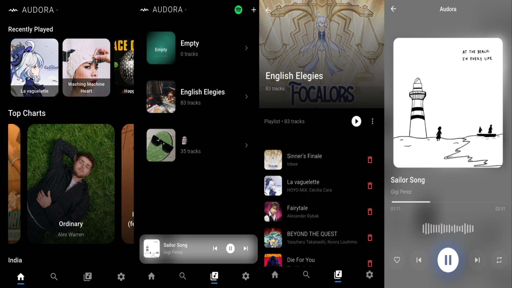

# Audora 🌀

Audora is a personal modern Flutter based music streaming app that lets you search, stream, and manage your own music tracks and playlists powered by Youtube and integrated with Spotify playlist import.

It’s designed to be lightweight, fast, and fully offline-capable after caching tracks + also capable of downloading tracks offline.

## ✨ **Features**

### 💽 **Ad-free Streaming**

- Search songs, artists, albums
- Stream high-quality audio from sources

### 🎧 **Custom Library**

- Make and customise playlists
- Add, delete, reorder tracks
- Recently played system

### 📈 **Discover**

- Using charts to fetch top charts
- Country based top songs
- Hand picked genres to kick off a start

### 📥 **Spotify Playlist Imports**

- Import spotify playlist via pasting url
- Automatically matches songs and picks accurate tracks

### 🚂 **Powerful Audio Engine**

- Background playback via `audio_service`
- Persistent mini-player
- Seamless playback between tracks
- Intelligent cache system

### 🎨 **UI & UX**

- Minimal, immersive black-themed interface
- Realtime updates
- Dynamic track based player
- Clean screens management

## 📸 **Screenshots**

### Home page, Library page, Custom playlist, Player screen (One Strip Screenshot).



## 📏 **Project Structure**

```

|lib:.
|   audio_manager.dart
|   audora_music.dart
|   main.dart
|
+---data
|       Hive data models
|
+---repository
|   |   audio_handler.dart
|   |
|   +---spotify
|   |       api files
|   |
|   \---ytm
|           api files
|
+---screens
|       screen files
|
+---utils
|       utils files
|
\---widgets
        widget files


```

## 🙌 **Contributing**

Open to contributions!

### 1) **Fork The Repository**

### 2) **Clone The Forked repository**

```bash
git clone https://github.com/<your-username>/Audora
cd Audora
```

### 3) **Create A New Branch**

```
git checkout -b feature/your-feature-name
```

### 4) **Make Your Changes**

### 5) **Commit The Changes**

```
git commit -m "feat: add feature name"
```

### 6) **Push The Branch**

```
git push origin feature/your-feature-name
```

### 7) **Open a Pull Request (PR) on GitHub**

For further instructions 👉 [Contributing](CONTRIBUTING.md)

## ⚙ **Requirements**

- Flutter >= 3.35.6
- AndroidSDK >= 36

## 📃 **License**

MIT License © 2025 dotflux
Feel free to fork, remix, and contribute, just credit the original project.
